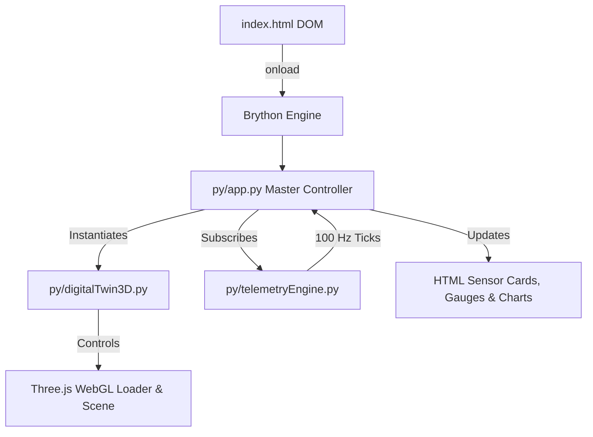

# GARUDAVYUHA – Frontend Architecture & UI Specification

This document provides a comprehensive technical overview of the **GARUDAVYUHA** Ground Control Station (GCS) user interface, detailing the design system, CSS architecture, HTML component layout hierarchy, 3D WebGL integration, and client-side view management.

---

## 🎨 Design System & Visual Aesthetics

GARUDAVYUHA features a modern, dark-mode aerospace tactical GCS theme inspired by military defense telemetry consoles and modern digital twin control suites.

### 1. Color Palette & Design Tokens
Defined in [`css/main.css`](file:///d:/Downloads/Udaan_trial/udaan-trail/css/main.css):

| Token | Hex / Value | Usage |
|---|---|---|
| `--bg-dark` | `#060b14` | Main application background |
| `--bg-card` | `rgba(15, 23, 42, 0.85)` | Glassmorphism card container background |
| `--border-cyan` | `rgba(0, 240, 255, 0.25)` | Default HUD widget borders |
| `--cyan-telemetry` | `#00f0ff` | Telemetry readouts, active highlights, primary indicators |
| `--color-green` | `#10b981` | Healthy status indicators & normal bounds |
| `--color-yellow` | `#f59e0b` | Warning states, medium degradation |
| `--color-red` | `#ef4444` | Critical fault alerts, thermal exceedances |
| `--text-muted` | `#94a3b8` | Subtitles, parameter labels, auxiliary text |

### 2. Glassmorphism & UI Accents
- **Card Styling**: `backdrop-filter: blur(12px)` paired with subtle linear gradients and cyan edge lighting.
- **Micro-Animations**: Smooth scale transitions on hover (`1.02`), pulsing glow keyframes for critical alerts (`pulse-glow`), and real-time canvas sparkline animations.
- **Typography**: 
  - Sans-Serif Heading/UI: Clean modern typography.
  - Monospace Data Font: Technical numerical readouts, timestamps, and flight telemetry.

---

## 📁 Modular CSS Architecture

The stylesheet architecture is organized into four decoupled files located in [`css/`](file:///d:/Downloads/Udaan_trial/udaan-trail/css):

```
css/
├── main.css          # Core CSS variables, resets, flex/grid layouts, top command header
├── components.css    # Cards, gauge rings, 3x3 sensor grid, sparklines, buttons & modal dialogs
├── twin3d.css        # 3D viewport canvas wrapper, floating tool buttons, overlay loading screen
└── views.css         # Page section visibility toggles & layout grids for specific views
```

1. **`main.css`**: Defines CSS root variables, grid templates for the header, main content area, and bottom dashboard panel.
2. **`components.css`**: Provides styling for:
   - **Engine Health Meter**: SVG circular dash-offset ring (`stroke-dasharray: 251.3`).
   - **3x3 Live Sensor Panel**: Grid layout featuring real-time value displays and inline canvas sparklines.
   - **100 Hz Telemetry Waveform**: Oscillating green telemetry banner.
   - **Action Buttons & Modals**: Glow buttons (`.btn-gcs-cyan`) and fault scenario modal overlays.
3. **`twin3d.css`**: Manages:
   - Floating quick tool buttons (Thermal IR, Wireframe, Auto-rotate, Reset camera).
   - Dynamic floating component info card for selected sub-assemblies.
   - In-scene status control buttons.
4. **`views.css`**: Manages tab switching (`.view-section` active states) and specialized layouts for AI Diagnostics, RUL Analytics, Mission Simulator, Mission Replay, and Maintenance Center.

---

## 🖥️ Layout & Section Hierarchy (`index.html`)

The DOM structure inside [`index.html`](file:///d:/Downloads/Udaan_trial/udaan-trail/index.html) is structured as follows:

```
<body>
  ├── <header id="gcs-header">               <!-- Brand, Live Status, Navigation Tabs, UTC Clock -->
  └── <main id="gcs-main-container">
        ├── <section id="view-command-center">    <!-- View 1: Main Dashboard -->
        │     ├── <div class="cc-top-row">
        │     │     ├── <aside class="cc-sidebar-left">  <!-- Mission Overview, Health Ring, RUL -->
        │     │     ├── <div class="cc-center-viewport"> <!-- 3D Digital Twin Viewport Mount -->
        │     │     └── <aside class="cc-sidebar-right"> <!-- 3x3 Sensor Grid & 100Hz Waveform -->
        │     └── <div class="cc-bottom-section">        <!-- 5 Graphs, Timeline, AI Summary -->
        │
        ├── <section id="view-digital-twin">       <!-- View 2: Fullscreen 3D CAD Twin -->
        ├── <section id="view-ai-diagnostics">     <!-- View 3: Anomaly Score & SHAP XAI -->
        ├── <section id="view-rul-health">         <!-- View 4: Weibull Model & Health Matrix -->
        ├── <section id="view-mission-simulator">  <!-- View 5: Flight Scenario Inputs -->
        ├── <section id="view-mission-replay">     <!-- View 6: Black-Box Telemetry Deck -->
        └── <section id="view-maintenance-center"> <!-- View 7: Work Orders & Overhauls -->
```

---

## 🕹️ Interactive Views & Component Specification

### View 1: Command Center (`#view-command-center`)
The primary operational screen matching tactical GCS requirements:
- **Left Panel**: Mission Overview parameters (`UAV ID: UDAAN-01`, `Mission: ISR-042`), circular SVG health meter, mission readiness bar, and estimated RUL readout.
- **Center Hero Viewport**: Mounts the Three.js WebGL canvas for the Rotax 914 engine twin with overlay status controls and floating toolbars.
- **Right Panel (3x3 Live Sensor Panel)**: Real-time cards displaying `RPM`, `CHT`, `EGT`, `OIL PRESS`, `OIL TEMP`, `FUEL FLOW`, `VIBRATION`, `BATTERY VOLT`, and `INJECTION TIMING`.
- **Bottom Dashboard**:
  - **5 Telemetry Sparkline Graphs**: Rendered via Chart.js / HTML5 Canvas for real-time trend monitoring.
  - **Event Timeline**: Color-coded system log messages.
  - **AI Diagnostics Summary**: Anomaly score bar, confidence meter dial, and severity level.
  - **Quick Actions Bar**: Buttons to trigger Fault Simulation, Mission Simulation, Replay, or Maintenance.

### View 2: Dedicated 3D Digital Twin (`#view-digital-twin`)
Moves the 3D viewport canvas wrapper dynamically into a full-screen layout for deep structural inspection.

### View 3: AI Diagnostics & Explainable AI (`#view-ai-diagnostics`)
- **Neural Anomaly Score**: Large metric readout with scale bar.
- **ML Pipeline Status**: Bi-LSTM Autoencoder, Isolation Forest, and XGBoost Classifier status indicators.
- **SHAP Attribution Bars**: Interactive bar charts showing individual parameter percentage contributions to anomaly detection.
- **Operator Tactical Advisory**: Human-readable natural language recommendations.

### View 4: RUL & Health Analytics (`#view-rul-health`)
- **Weibull Hazard Model Metrics**: Shape parameter ($\beta = 2.42$), Scale parameter ($\eta = 1,200 \text{ hrs}$), Accumulated TBO flight hours.
- **Degradation Trajectory Chart**: Historical health vs. projected confidence intervals.
- **Component Breakdown Table**: Matrix listing condition, remaining hours, and maintenance priority for all 8 subsystems.

### View 5: Mission Simulator (`#view-mission-simulator`)
- **Interactive Form Sliders**: Flight Altitude (`0 - 25,000 ft`), Ambient Temp (`-40°C - +50°C`), Duration (`1 - 14 hrs`), Throttle Profile dropdown.
- **Scenario Presets**: High Altitude, Long Endurance, Hot Desert, Rapid Throttle.
- **Hourly Forecast Canvas**: Projected thermal and wear degradation over mission length.

### View 6: Black-Box Mission Replay (`#view-mission-replay`)
- **Playback Controls**: Play/Pause toggle, Time display (`HH:MM:SS`), Speed multipliers (`1x`, `2x`, `5x`, `10x`).
- **Scrubbable Timeline Slider**: Interactive timeline with key mission bookmarks (Takeoff, FL160, Vibration Onset, RTB).
- **Synchronized 3D Mount**: Viewport moves to replay panel during playback.

### View 7: Maintenance Center (`#view-maintenance-center`)
- **Work Order Grid**: Cards generated dynamically based on active telemetry anomalies.
- **Virtual Overhaul Button**: Simulates maintenance operations, resetting subsystem health and clear highlights on the 3D twin.
- **Printable Modal**: Exportable GCS technical work order summary.

---

## ⚡ Client-Side Execution & Python Interop

The frontend leverages **Brython** (Python 3 runtime in WebAssembly/JS) for all UI application logic:



- **JavaScript Bridge**: Three.js, OrbitControls, GLTFLoader, and Chart.js are exposed to Python via `window.THREE`, `window.OrbitControls`, `window.GLTFLoader`, and `window.Chart`.
- **Event Handling**: Navigation clicks, slider inputs, and 3D raycasting pointer events map directly to Python handlers in `py/app.py`.
